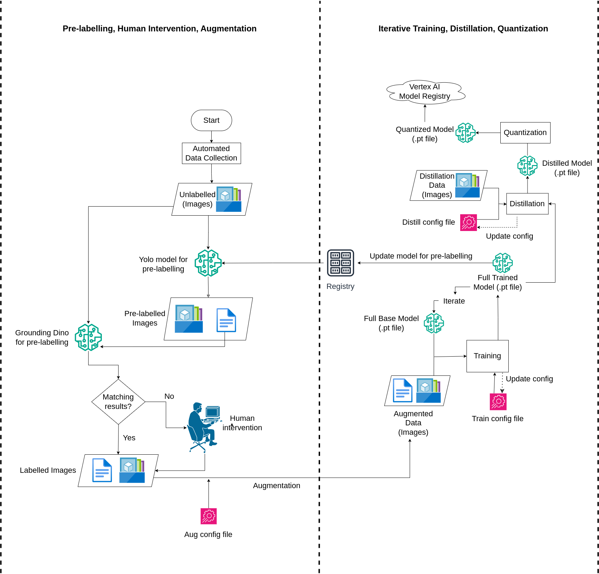

# Pipeline Overview

The figure below illustrates the complete CI/CD/CT pipeline we developed for automated wildfire detection.

This pipeline is composed of the following stages:

1. **Automated Data Collection** – Continuously gathers unlabelled image data.
2. **Pre-labelling** – Uses YOLOv8 and Grounding DINO for generating bounding box predictions.
3. **Matching & Filtering** – Compares predictions to filter out mismatches.
4. **Human-in-the-loop Review** – Supports manual verification via Label Studio for unmatched samples.
5. **Augmentation** – Applies image transformations to enrich training data.
6. **Training** – Fine-tunes the YOLOv8 model using labeled and augmented data.
7. **Distillation & Quantization** – Optimizes the trained model for lightweight deployment.
8. **CI/CD Integration** – Final models are versioned and registered for deployment.

