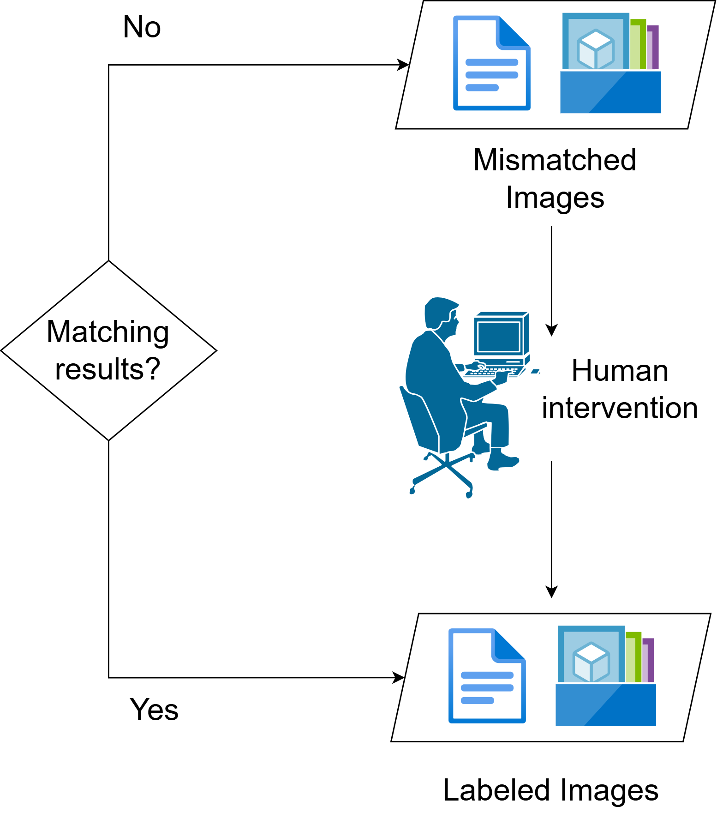
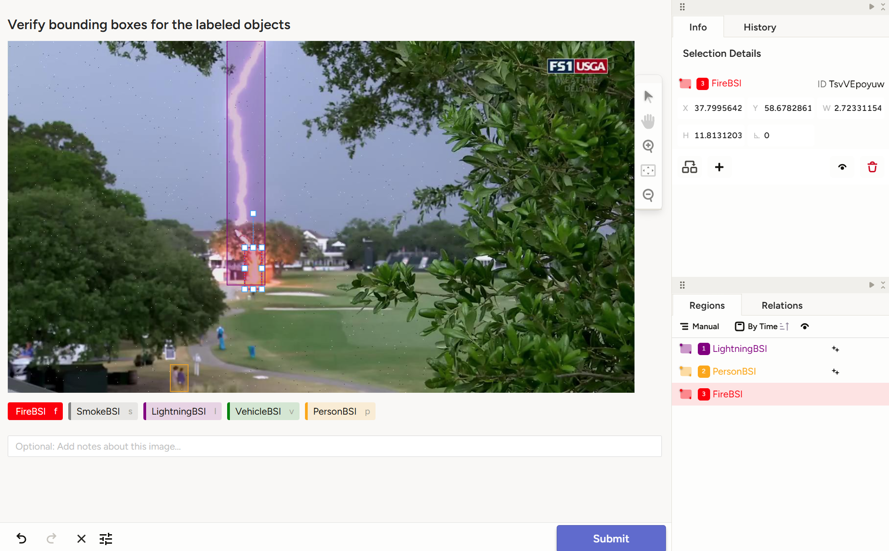

### Human-in-the-loop

1. **Motivation**

   A **high-performing model** relies on a **high-quality labeled dataset**. While YOLOv8 and GroundingDINO agree on many predictions, there are still **mismatches** that need correction. Instead of discarding these potentially valuable samples, we introduce a **human-in-the-loop workflow** to verify and fix labeling errors with Label Studio[@labelstudio]. This process improves data quality with **minimal manual effort**, streamlining the correction process and reducing the need for manual file editing.

2. **Input**

   - JSON files with incorrect or uncertain predictions from YOLO, containing labels, bounding box coordinates, and confidence score
   - Corresponding image files referenced in those predictions

3. **Workflow Steps**

   {width="40%"}

   - **Step 1:** Place mismatched prediction files in  
     `automl_workspace/data_pipeline/label_studio/pending/`
   - **Step 2:** Run the script to convert them into Label Studio tasks using images from  
     `automl_workspace/data_pipeline/input/`
   - **Step 3:** Review and fix labels visually in the intuitive Label Studio interface

     {width="80%"}

   - **Step 4:** Export the reviewed results to  
     `automl_workspace/data_pipeline/label_studio/results/` 

   - **Step 5:** Reviewed prediction files are moved from pending directory to  
     `automl_workspace/data_pipeline/labeled/`, available for the training phase

   The script automatically tracks review status throughout the process.

4. **Output**

   - Corrected label files (JSON), ready for training
   - Results are versioned automatically for easy tracking

5. **Impact**

   The human-in-the-loop workflow makes better use of mismatched data. Reviewers can easily correct labels through an intuitive interface, without editing raw files manually. The reviewed results are saved in a consistent format, ready for training. Overall, this workflow improves the quality of the training dataset, allowing the model to learn from a wider range of examples.

