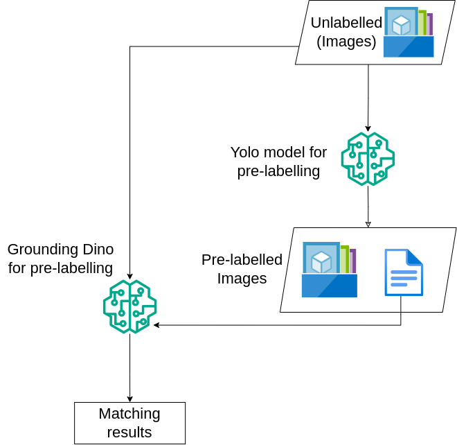

### Automated Labeling and Matching

Manual annotation is time-consuming and inconsistent. To streamline this process, we employ a dual-model pre-labeling strategy using YOLOv8 [@yolov8_ultralytics] and Grounding DINO [@grounding_dino]. This setup leverages model agreement to reduce manual labeling needs while preserving uncertain cases for human review. The goal is to automatically generate accurate labels with minimal intervention.

[Figure 2](#fig-labeling-workflow) below illustrates this labeling and matching process.

::: {.cell}
{#fig-labeling-workflow width="60%" fig-pos="H"}
:::

1. **Input**

   - Unlabeled images are passed through the pipeline.
   - Two object detection models are used:
     - **YOLOv8**: Trained specifically on five wildfire-related categories – Fire, Smoke, Lightning, Human, and Vehicle.
     - **Grounding DINO**: Uses the same categories as prompts to perform open-vocabulary detection.

2. **Workflow Steps**

   - **Step 1:** YOLOv8 predicts bounding boxes and class labels.
   - **Step 2:** Grounding DINO makes independent predictions using the same category prompts.
   - **Step 3:** A matching script compares predictions using an Intersection over Union (IoU) threshold:
     - If predictions align, the image is automatically labeled.
     - If predictions disagree, the image is flagged for human review.
   - **Step 4:** Confirmed matches are saved in a standardized format for downstream use.

3. **Output**

   - A curated dataset of confidently labeled images.
   - Uncertain cases routed for human-in-the-loop review.
   - Each labeled file contains bounding boxes, class names, and confidence scores.

4. **Impact**

   This automated labeling workflow reduces reliance on full manual annotation, ensures consistent labeling across large batches, and accelerates dataset preparation while maintaining label accuracy.
