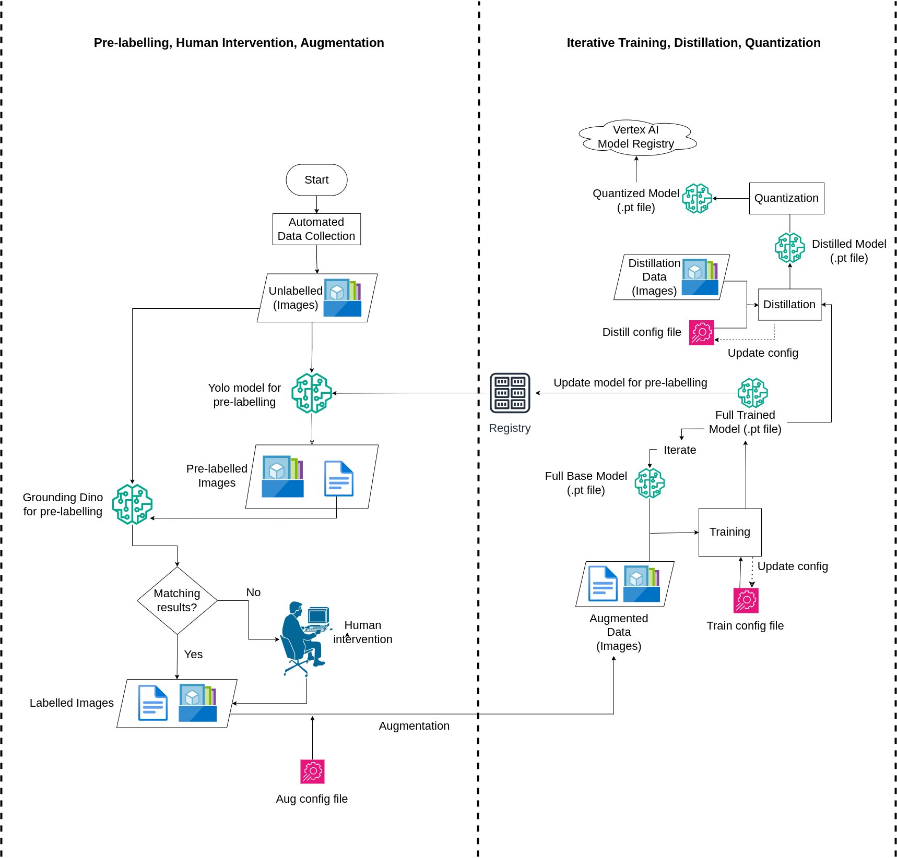

Our AutoML pipeline is designed for **scalable wildfire object detection**, with a focus on **automation**, **accuracy**, and **efficiency**. The system continuously processes new data and improves model performance through an iterative loop of labeling, training, distillation, and quantization. Below is a high-level summary of the core components:

### End-to-End Pipeline Flow

{width="100%"}

### Pipeline Stages

1. **Automated Labeling and Matching**  
   Automatically generates object labels using two models (YOLOv8 and Grounding DINO). If both models agree, the label is accepted. Disagreements are routed to human review.

2. **Human-in-the-Loop**  
   Mismatched cases are corrected through a Label Studio interface. This step ensures high-quality annotations without requiring full manual labeling.

3. **Augmentation**  
   Labeled data is augmented using transformations like flipping, rotation, and brightness changes. This step increases dataset diversity and robustness.

4. **Model Training**  
   A YOLOv8 model is trained on the labeled and augmented dataset. Training is guided by configuration files that allow reproducible tuning and GPU/CPU flexibility.

5. **Model Distillation**  
   The trained model is distilled into a smaller version for faster inference, reducing model size while preserving performance.

6. **Quantization**  
   The distilled model is quantized to further reduce its size and improve deployment speed, especially for edge environments.

Each component is explained in more detail in the following sections.